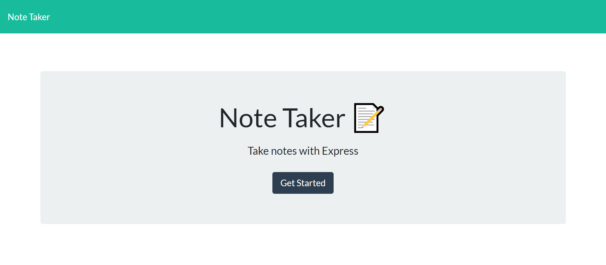
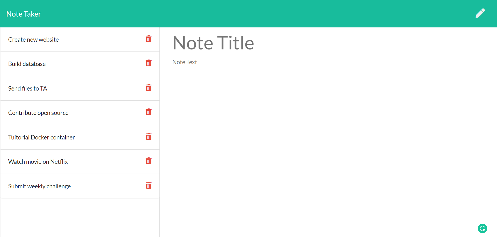

# Note-Taker

## Description

Its a node application that uses express.js framework.It helps individuals to store their todos or notes,They have the ability to delete and edit any note.

## Table of Contents

- [Usage](#usage)
- [Credits](#credits)
- [License](#license)
- [Visuals](#visuals)

## Usage

As it is node application install all the npm dependencies required before runing the app

## Website

[website](https://polar-scrubland-34085.herokuapp.com/notes)

## Credits

Frontend developer team

## License

## Contribution

Fork it to your github repos ,then you can make any changes with out affecting the main source code

[My Github Profile](https://github.com/solomonmeresa)

## How to reach me

Email : solomonmeresa8@gmail.com

## visuals

Made by solomon

### ©️2020 Note-taker
